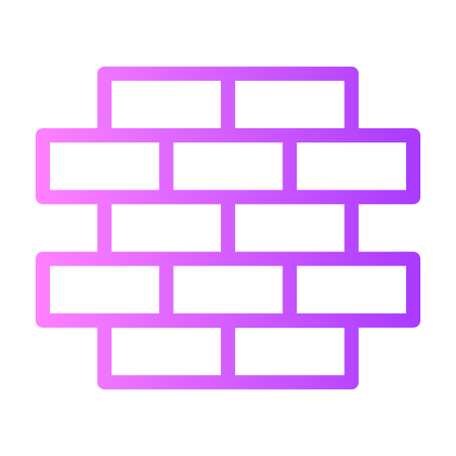

<!DOCTYPE html>
<html lang="en">
<head>
    <meta charset="UTF-8">
    <meta http-equiv="X-UA-Compatible" content="IE=edge">
    <meta name="viewport" content="width=device-width, initial-scale=1.0">
    <title>Document</title>
    
    <link rel="stylesheet" href="style.css">
</head>
<body>
   
    

        

            <h2>Електронний каталог товарів</h2>
            <button class="topButton">Замовлення 
0
</button>
           
        

        

            
  <h2>Tools</h2>

            
  <h2>BuildingMaterial</h2>

        
   
        
 
            

        

    

    

        

            <button class="productCheckExit">X</button>
        

        <h3>T3OB Shop</h3>
        <h3>Україна,Львівська Область Новояворівськ</h3>

        

    

    
</body>
</html>
